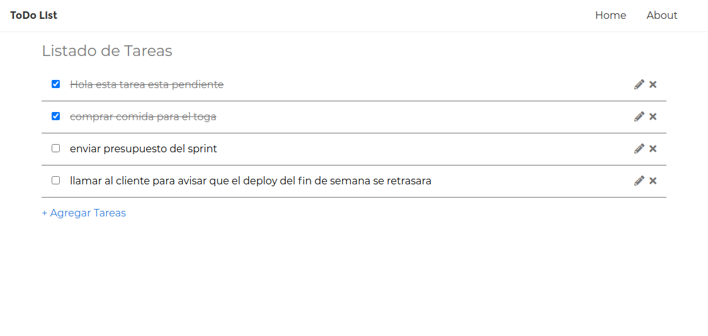

# vue-todo-list

Simple proyecto basico de practica en [Vue.js](https://es.vuejs.org/) implementar una lista de Tareas ToDo.

## Requisitos

- Node v10.x
- Vue.js 2.x
- express (Deploy en heroku)

Puede probar la ultima versión en https://rq-todo-list.herokuapp.com/

